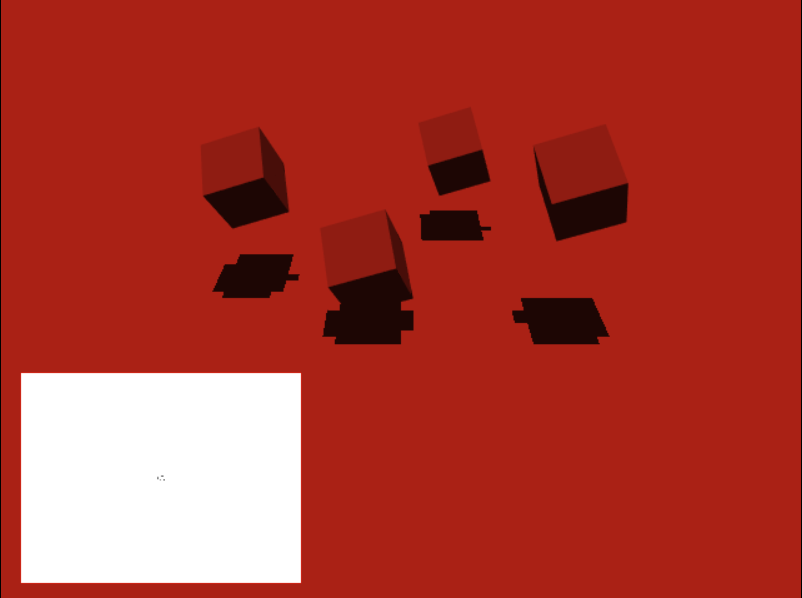

# WebGL Samples

## Setup

### Install

To run this sample, you need [npm](https://www.npmjs.com/get-npm).

Then from the root folder, run this command to install dependencies:

```
npm install
```

### Run

Start the server (see below) and navigate to http://localhost:8000

```
npm run dev
```

## Shadow Mapping

Implementing scene dependent shadow mapping by using shadow casters' bounding box.


## Walkthrough

### Motivations

There are already many tutorials on the internet and articles showing how to implement shadow mapping. However, most of them do not go into too many details on how to dynamically compute the light transform and instead use a fixed transform that works well for the demo scene. Since the light's transform directly affects shadow quality, a logical next step after implementing shadow mapping would be to understand how to dynamically compute this light transform to maximize shadow quality. Understanding this will also be helpful to  implement more advanced shadow mapping algorithms such as Cascaded Shadow Maps.

### Shadow Mapping Algorithm

First, let's summarize the basic shadow mapping algorithm:

1. Render a depth buffer per light in a separate render pass
     * Compute the view and projection transforms for your light (orthographic projection for directional lights or perspective for point, spotlights)
     * Render your scene in a separate render pass onto a depth buffer for your light using this transform as the view + projection matrix instead of your camera view + projection transforms.
     * Repeat this if your technique requires multiple depth buffers (e.g. point lights use a cube map, cascaded shadow maps use multiple depth maps).
2. Use this/these depth buffer in your material pass to determine if your fragment is in shadow or not
     * Transform your world fragment into light space using your light's view and projection matrices. This can be done either in the vertex or the fragment shader. Note that if you have a lot of lights, it might be easier to do it in the fragment shader, else you'll have to transfer all these light fragments from the vertex to the fragment shader.
     * Use this transformed coordinate now in clip space to sample the light's depth texture.
     * Compare this depth with your current fragment depth to determine if the fragment is in shadow or not. Usually a bias is used here to prevent shadow acne and PCF filtering to improve shadow quality.
     * Render your fragment without the diffuse and specular contributions if it's in shadow (only ambient light remains).

A good tutorial on this subject is [this tutorial from learnopengl.com](https://learnopengl.com/Advanced-Lighting/Shadows/Shadow-Mapping). [This article from Microsoft](https://docs.microsoft.com/en-us/windows/win32/dxtecharts/common-techniques-to-improve-shadow-depth-maps) also contains insightful information on how to improve shadow quality.

This articles focuses on how to compute the orthographic transform for directional lights to maximize shadow quality. This article will not go into too much details on the actual shadow mapping algorithm so please refer to other shadow mapping tutorials as necessary.

### The Light Transform

As mentioned earlier, directional lights use orthographic projection to render objects onto a shadow map. This orthographic projection can be derived directly from an axis aligned bounding box in the light's view coordinate system. This bounding box defines which objects needs to be rendered onto the shadow map. All objects inside this bounding box will be rendered onto one face of this box, usually on the plane facing in *-z* in local light coordinates.

Let's start with a simple example to show how this work.

Let's say you have objects around the world's origin, all within 10 meter around the origin and you want to render shadows for all of them for a directional light looking straight down.


You'll need to define a 10 meter bounding box that you'll then transform into light space to build your view and projection matrices. Let's define the world system coordinate with y axis pointing up and the forward vector of our light pointing at -z in the light's local coordinate system.


#### View Transform

First, let's compute the view transform for this light. Since all we need is an axis aligned bounding box, the position part of the view transform can be chosen arbitrarily, as long as your bounding box is defined relative to this position. With this in mind, let's choose a position of (0, 0, 0). Note that this works even if the bounding box is not centered around the origin.

Next we need a rotation matrix, which can be defined by 3 orthonormal vectors. The first vector is our light direction vector which points down:

```javascript
const lightDir = vec3.fromValues(0.0, -1.0, 0.0);
```

We can then choose the up and right vector arbitrarily. We choose the right vector as *x* if it's not parallel to our light direction, else *y*:

```javascript
let right = vec3.fromValues(1.0, 0.0, 0.0);
if (Math.abs(vec3.dot(lightDir, right)) > 0.9999) {
    right = vec3.fromValues(0.0, 0.0, 1.0);
}
```

Then we choose the up vector to be the cross product of the light direction and the right vector, to have a valid orthonormal rotation matrix:

```javascript
const up = vec3.create();
vec3.cross(up, lightDir, right);
```

We now have the 3 vectors we need to build the view transform:

```javascript
var viewMatrix = mat4.create();
mat4.lookAt(viewMatrix,
    vec3.create(), // eye (position)
    lightDir, // center (direction)
    up
);
```

#### Orthographic Projection

To build the orthographic project matrix, we start with our bounding box in world coordinates:

```javascript
var boxWorld = new BoundingBox();
boxWorld.min = vec3.fromValues(-10, -10, -10);
boxWorld.max = vec3.fromValues(10, 10, 10);
```

Then transform this bounding box in the lights' view coordinates:

```javascript
var boxLight = boxWorld.clone();
boxLight.transform(viewMatrix);
```

Then we can use this directly to compute the projection matrix:

```javascript
var projectionMatrix = mat4.create();
mat4.ortho(projectionMatrix,
    boxLight.min[0], boxLight.max[0],
    boxLight.min[1], boxLight.max[1],
    -boxLight.max[2], -boxLight.min[2] // looking at -z
);
```

Note: if you're in C++ using glm, you don't need to invert the z axis like it's done here, you can use boxLight.min.z, boxLight.max.z directly. I suppose this is because of the handedness of the transforms on gl-matrix vs glm.

So there we have it, then you can pass these transforms to your shaders and transform from world to light clip space with:

```glsl
highp vec4 p_light = projectionMatrix * viewMatrix * vec4(p_world, 1.0); 
```

### Computing the bounding box

The axis-aligned bounding box can be defined as min and a max value. To compute this bounding box for an object, you just have to take the min/max vertex values for your mesh. You can then transform this bounding box into world coordinates.

### Applying a coordinate transform to a bounding box

To transform a bounding box from one coordinate system (e.g. world) to another (e.g. light):

1. Compute the 8 corners of your bounding box

```js
getCorners() {
    return [
        vec3.fromValues(this.min[0], this.min[1], this.min[2]),
        vec3.fromValues(this.min[0], this.min[1], this.max[2]),
        vec3.fromValues(this.min[0], this.max[1], this.min[2]),
        vec3.fromValues(this.min[0], this.max[1], this.max[2]),
        vec3.fromValues(this.max[0], this.min[1], this.min[2]),
        vec3.fromValues(this.max[0], this.min[1], this.max[2]),
        vec3.fromValues(this.max[0], this.max[1], this.min[2]),
        vec3.fromValues(this.max[0], this.max[1], this.max[2])
    ];
}
```

2. Transform each of these corners into the new coordinate system using the transform matrix.

```js
transform(transformMatrix) {
    // We can't just take the min/max we have
    // since this only applies to this coordinate
    // system. We need to reproject all box corners.
    const corners = this.getCorners();

    this.reset();
    for (const corner3 of corners) {
        // p = T * corner;
        const p4 = vec4.create();
        const corner4 = vec4.fromValues(
            corner3[0], corner3[1], corner3[2], 1.0);
        vec4.transformMat4(p4, corner4, transformMatrix);

        // ...
    }
}
```

3. Take the min/max of the transformed points to get the new bounding box.


```js
transform(transformMatrix) {
    // We can't just take the min/max we have
    // since this only applies to this coordinate
    // system. We need to reproject all box corners.
    const corners = this.getCorners();

    this.reset();
    for (const corner3 of corners) {
        // p = T * corner;
        // ...

        // keep min/max
        const p3 = vec3.fromValues(
            p4[0]/p4[3],
            p4[1]/p4[3],
            p4[2]/p4[3]);
        vec3.min(this.min, this.min, p3);
        vec3.max(this.max, this.max, p3);
    }
}
```

See bounding_box.js for the implementation.

<!-- With this, you can compute the world bounding box of all objects in your scene you'll need for shadow casting, then combine these boxes into one bounding box and transform this box into the light's view space to build your light projection matrix. -->

### Choosing a bounding box

This technique can be used to define any bounding box for which you want to render shadows. For each object in your scene, you can compute its bounding box and combine the boxes of all the objects you need shadows for as one big bounding box. Then this box is transformed into the light's view space to compute the light's transform.

Now which objects should we include in this bounding box? We have shadow casters (cubes in this example) and shadow receivers (the plane in this example).

#### All objects in the scene

We can start by including all shadow casters and shadow receivers to make sure that all shadows are rendered on screen. You'll get something like this:


We see that including shadow receivers is useless since we don't need to render them to the depth map. We then have less resolution for the objects that we actually need and this affects the shadow quality. If the scene is very large, including all objects in the bounding box can give very pixelated shadows.



Each cube there uses only a couple of fragments in the shadow map so when we reproject these fragments on the camera, a lot of fragments share the same depth, hence these pixelated shadows.

#### Shadow casters only

So what if we render all shadow casters to the depth map and ignore shadow receivers?


That's pretty good! There is no more wasted space around objects we don't need to render to the depth map. The bounding box used is shown in green here.

However, if there are objects outside the view frustrum, depth map fragments will be wasted rendering these objects to the depth map since we won't see these shadows:


#### Camera frustrum only

To improve on this solution, one could render to the shadow map, only objects inside the view frustrum. First, the camera frustrum bounding box needs to be determined. Four camera points for the near plane and four for the far planes can be reprojected in world coordinates, then min/max'ed to get a bounding box (see ShadowMap.updateTransforms and Camera.computeFrustrumCorners):

TODO THIS IS EASIER, JUST NEED CLIP COORDINATES

```javascript
let camCorners = camera.computeFrustrumCorners();
let camBox = BoundingBox.fromPoints(camCorners);
```

Then the light frustrum bounding box can be determined by taking the min/max value of the two boxes:

```javascript
vec3.max(camBox.min, camBox.min, sceneBox.min);
vec3.max(camBox.max, camBox.max, sceneBox.max);
```

#### Combined camera frustrum and shadow casters


<!-- Examples to explain why shadow bounding box is important:

* (X) Big plane: poor shadows
* Only shadow casters: better
* What if one shadow caster is far away: poor shadows
* Only shadow casters in camera frustrum: missing a shadow!
* Only shadow casters in camera frustrum and in -(light direction) -->

### Cascaded shadow maps

next step.
